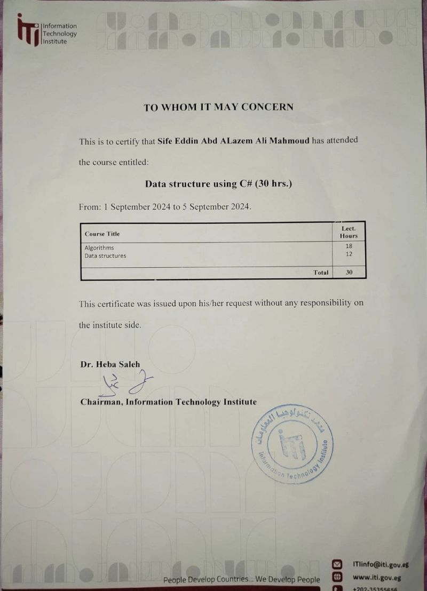

# 📜 ITI Certification

## 📘 Data Structure using C# (30 hrs)
I have successfully attended the course **Data Structure using C# (30 hrs)** at the **Information Technology Institute (ITI)** from **1 September 2024 to 5 September 2024**.  

This training covered:
- Algorithms (18 hrs)  
- Data Structures (12 hrs)  

**Certificate Preview:**  
  

🔗 [Download Certificate](./1759311515158.jpeg)
